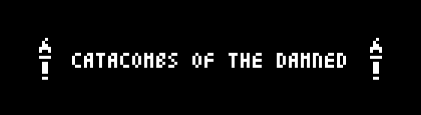
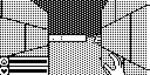
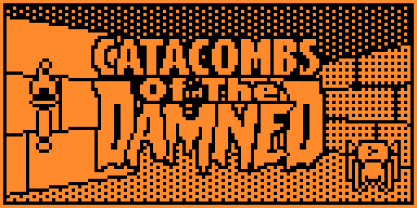
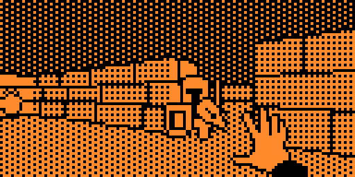
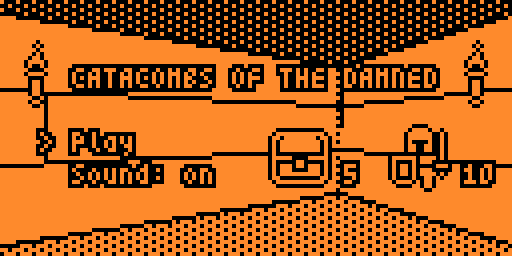
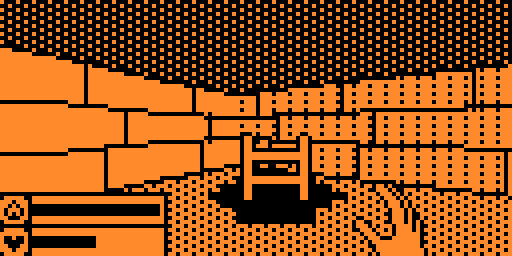
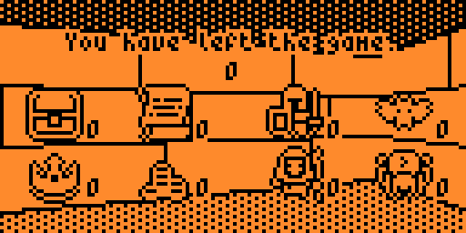

**Catacombs of the Damned!** is a first-person shooter / dungeon crawler for the [Arduboy miniature game system](https://www.arduboy.com).
Explore **10 floors** of a procedurally generated dungeon, destroy monsters with magical fireballs, and collect as much loot as you can.

The game is partially inspired by the classic **Catacomb 3D** series.

## Features

* Smooth real-time 3D gameplay
* Sound effects
* Procedurally generated levels
* Four different enemy types
* Plenty of treasures to collect

## About the Project

This repository is a **fork** of the original [Arduboy3D](https://github.com/jhhoward/Arduboy3D) project by James Howard.

The main goal of this fork is to **port the game from Arduboy to the Flipper Zero** handheld device.

## Screenshots
|                                             |                                             |
| ------------------------------------------- | ------------------------------------------- |
|  |  |
|  |  |
|  |  |

## Community Discussion 

### Arduboy

The development history and original discussion can be found in the Arduboy community [forum thread](https://community.arduboy.com/t/another-fps-style-3d-demo/6565) (English).

## Original Project

**James Howard**
[Arduboy3D](https://github.com/jhhoward/Arduboy3D)